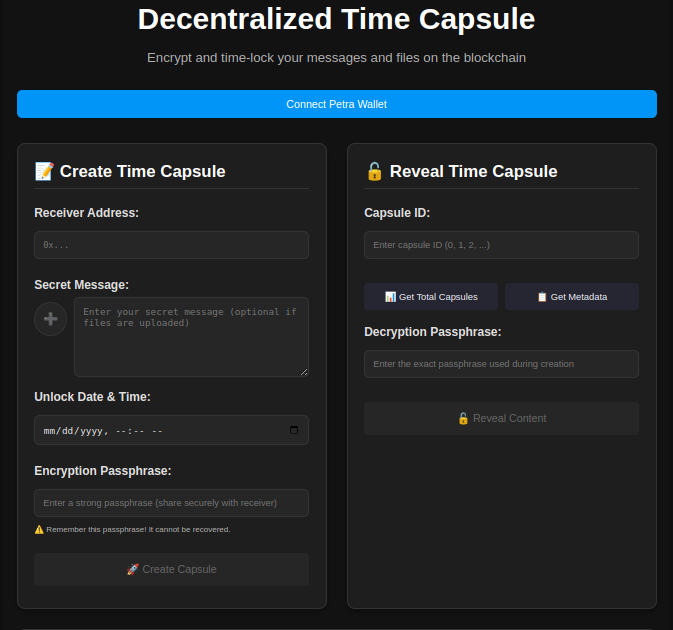

# Time Capsule dApp

A decentralized time capsule application built on the Aptos blockchain that allows users to create encrypted messages and files that can only be unlocked at a specific future time.

## 🚀 Features

- **Create Time Capsules**: Store encrypted text messages and files with a future unlock time
- **Secure Encryption**: Content is encrypted before being stored on-chain
- **Time-locked Access**: Capsules can only be opened after the specified unlock time
- **Sender/Receiver Model**: Send capsules to specific addresses or yourself
- **Multiple Content Types**: Support for text, files, or mixed content
- **Decentralized Storage**: All data stored on the Aptos blockchain

## 📁 Project Structure

```
time-capsule-dapp/
├── frontend/              # ReactJS frontend application
│   ├── src/
│   │   ├── components/    # React components
│   │   ├── hooks/         # Custom React hooks
│   │   ├── utils/         # Utility functions
│   │   ├── services/      # API and blockchain services
│   │   └── styles/        # CSS/styling files
│   ├── public/
│   └── package.json
├── move/                  # Aptos Move smart contracts
│   ├── sources/
│   │   └── time_capsule.move
│   ├── Move.toml
│   └── tests/
└── README.md
```

## 🛠 Technology Stack

### Frontend
- **React 18+** - Modern React with hooks
- **TypeScript** - Type-safe JavaScript
- **Aptos Wallet Adapter** - Wallet integration
- **Aptos TypeScript SDK** - Blockchain interaction
- **Tailwind CSS** - Utility-first styling
- **Crypto-JS** - Client-side encryption
- **React Router** - Navigation
- **Date-fns** - Date manipulation

### Blockchain
- **Aptos Blockchain** - Layer 1 blockchain
- **Move Language** - Smart contract development

## 📋 Prerequisites

- Node.js (v16 or higher)
- npm or yarn
- Aptos CLI
- Compatible wallet (Petra, Martian, etc.)

## 🚀 Getting Started

### 1. Clone the Repository
```bash
git clone https://github.com/your-username/time-capsule-dapp.git
cd time-capsule-dapp
```

### 2. Smart Contract Setup
```bash
# Navigate to move directory
cd move

# Install Aptos CLI if not already installed
curl -fsSL "https://aptos.dev/scripts/install_cli.py" | python3

# Initialize Aptos account (if needed)
aptos init

# Compile the contract
aptos move compile

# Deploy the contract
aptos move publish
```

### 3. Frontend Setup
```bash
# Navigate to frontend directory
cd frontend

# Install dependencies
npm install

# Create environment file
cp .env.example .env.local

# Update .env.local with your contract address
REACT_APP_CONTRACT_ADDRESS=0xYOUR_CONTRACT_ADDRESS
REACT_APP_NETWORK=testnet

# Start development server
npm start
```

The application will be available at `http://localhost:3000`

## 🔧 Configuration

### Environment Variables
Create a `.env.local` file in the frontend directory:

```env
REACT_APP_CONTRACT_ADDRESS=0xYOUR_DEPLOYED_CONTRACT_ADDRESS
REACT_APP_NETWORK=testnet
REACT_APP_NODE_URL=https://fullnode.testnet.aptoslabs.com/v1
REACT_APP_ENCRYPTION_KEY=your-encryption-key
```

### Move.toml Configuration
```toml
[package]
name = "time_capsule"
version = "1.0.0"

[addresses]
time_capsule = "_"

[dev-addresses]
time_capsule = "0xYOUR_ADDRESS"

[dependencies]
AptosFramework = { git = "https://github.com/aptos-labs/aptos-core.git", subdir = "aptos-move/framework/aptos-framework", rev = "main" }
```

## 📱 Frontend Components

### Key Components
- **CapsuleCreator** - Form to create new time capsules
- **CapsuleList** - Display user's capsules (sent/received)
- **CapsuleViewer** - View and unlock capsules
- **WalletConnect** - Wallet connection interface
- **FileUpload** - Handle file uploads and encryption
- **TimeSelector** - Date/time picker for unlock time

### Custom Hooks
- **useWallet** - Wallet connection and state management
- **useCapsules** - Capsule data fetching and management
- **useEncryption** - Client-side encryption utilities

## 🔐 Smart Contract Functions

### Public Entry Functions
- `init_storage(admin: &signer)` - Initialize contract storage
- `create_capsule(sender, receiver, unlock_time, encrypted, content_type)` - Create new capsule

### View Functions
- `get_capsules_len()` - Get total number of capsules
- `capsule_meta(id)` - Get capsule metadata
- `reveal_encrypted(caller, id)` - Get encrypted content if unlocked
- `reveal_encrypted_bytes(caller, id)` - Get raw encrypted bytes

## 🔒 Security Features

- **Time-locked Access**: Capsules cannot be opened before unlock time
- **Authorization**: Only sender or receiver can access content
- **Client-side Encryption**: Content encrypted before blockchain storage
- **Hex Storage**: Encrypted data stored as hex strings on-chain

## 🧪 Testing

### Smart Contract Tests
```bash
cd move
aptos move test
```

### Frontend Tests
```bash
cd frontend
npm test
```

### Integration Tests
```bash
npm run test:integration
```

## 📚 Usage Examples

### Creating a Text Capsule
```typescript
const createTextCapsule = async (
  message: string,
  receiverAddress: string,
  unlockDate: Date
) => {
  const encrypted = encryptMessage(message);
  await createCapsule(
    receiverAddress,
    Math.floor(unlockDate.getTime() / 1000),
    encrypted,
    "text"
  );
};
```

### Creating a File Capsule
```typescript
const createFileCapsule = async (
  file: File,
  receiverAddress: string,
  unlockDate: Date
) => {
  const fileData = await fileToBase64(file);
  const encrypted = encryptData(fileData);
  await createCapsule(
    receiverAddress,
    Math.floor(unlockDate.getTime() / 1000),
    encrypted,
    "file"
  );
};
```

## 🚀 Deployment

### Testnet Deployment
```bash
# Deploy contract to testnet
aptos move publish --profile testnet

# Build frontend for production
cd frontend
npm run build

# Deploy to your preferred hosting service
```

### Mainnet Deployment
```bash
# Switch to mainnet profile
aptos init --profile mainnet

# Deploy contract
aptos move publish --profile mainnet
```

## 🤝 Contributing

1. Fork the repository
2. Create a feature branch (`git checkout -b feature/amazing-feature`)
3. Commit your changes (`git commit -m 'Add amazing feature'`)
4. Push to the branch (`git push origin feature/amazing-feature`)
5. Open a Pull Request

## 📝 Development Guidelines

- Follow React best practices and hooks patterns
- Use TypeScript for type safety
- Write comprehensive tests for smart contracts
- Follow Move coding standards
- Use meaningful commit messages
- Document all public functions

## 🐛 Troubleshooting

### Common Issues

**Wallet Connection Issues**
- Ensure wallet extension is installed and unlocked
- Check network configuration matches your deployment

**Transaction Failures**
- Verify sufficient APT balance for gas fees
- Check contract address is correct
- Ensure unlock time is in the future

**Encryption/Decryption Issues**
- Verify encryption key consistency
- Check data format (hex string vs bytes)

## 📄 License

This project is licensed under the MIT License - see the [LICENSE](LICENSE) file for details.

## 🔗 Links

- [Aptos Documentation](https://aptos.dev)
- [Move Language Guide](https://move-language.github.io/move/)
- [React Documentation](https://reactjs.org)
- [Aptos Wallet Adapter](https://github.com/aptos-labs/aptos-wallet-adapter)

## 📞 Support

For questions and support:
- Create an issue in the repository
- Join our Discord community
- Contact the development team

---

Built with ❤️ on Aptos Blockchain


